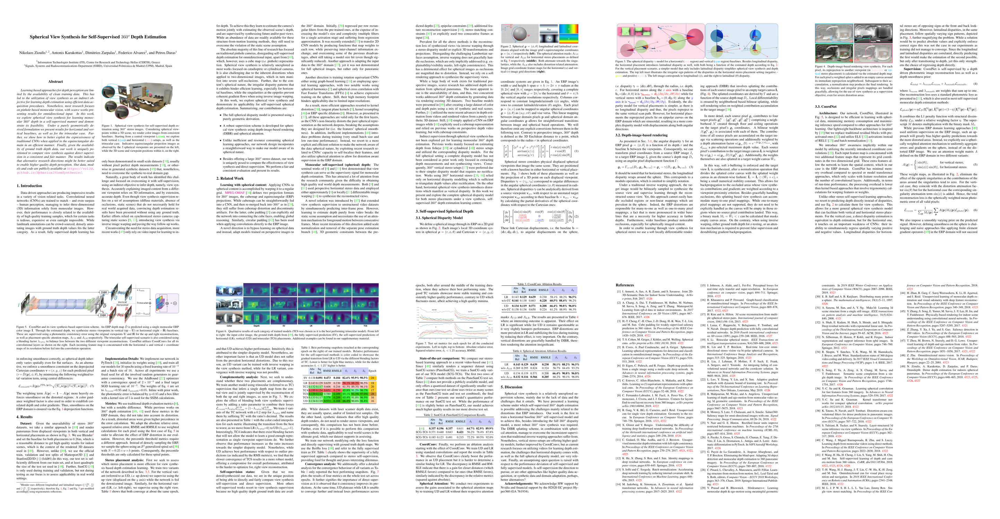
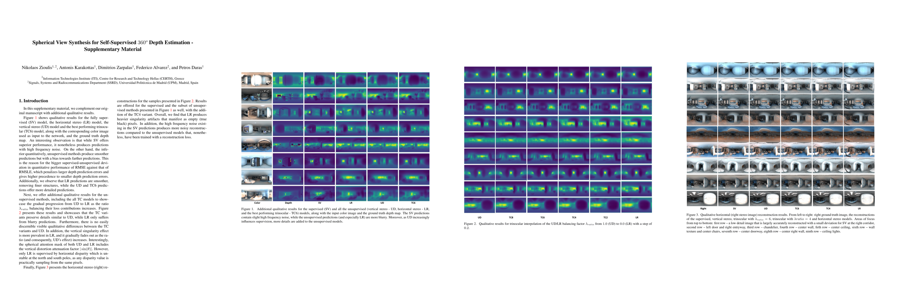
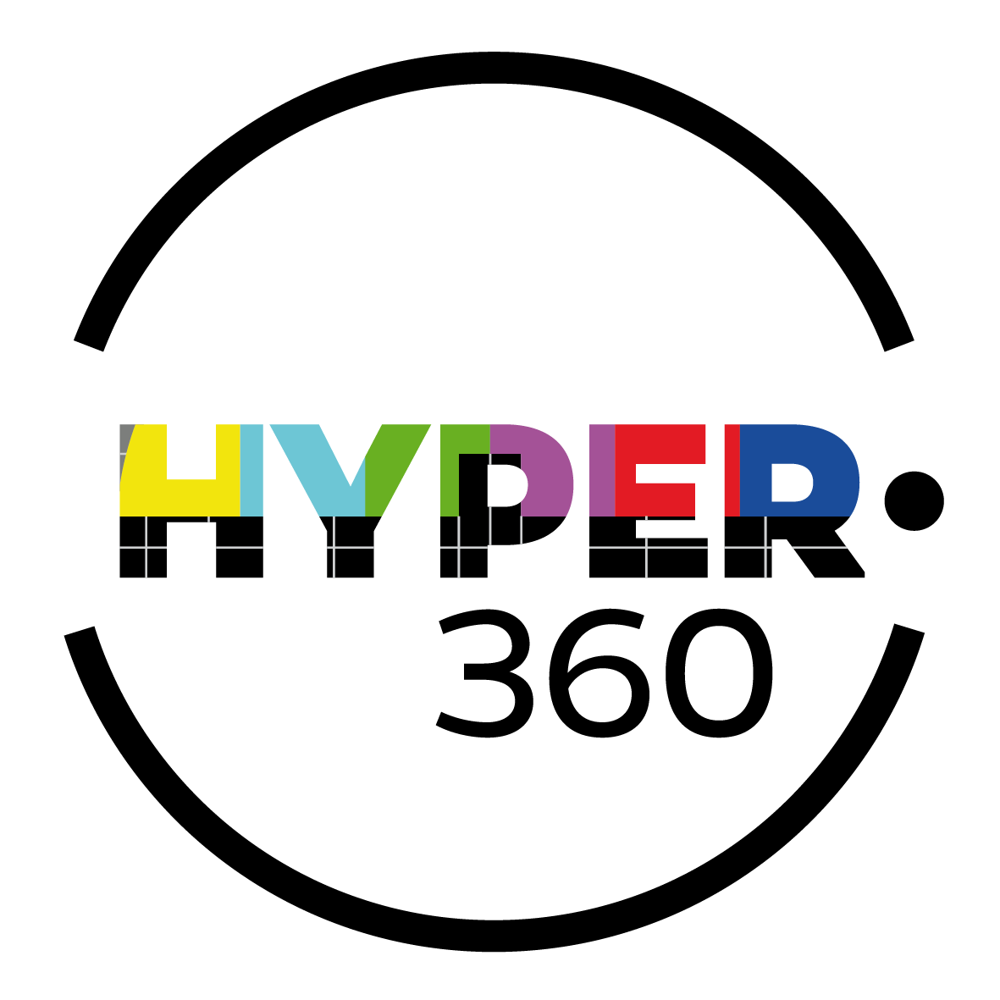

# Abstract

Learning based approaches for depth perception are limited by the availability of clean training data. 
This has led to the utilization of view synthesis as an indirect objective for learning depth estimation using efficient data acquisition procedures. 
Nonetheless, most research focuses on pinhole based monocular vision, with scarce works presenting results for omnidirectional input.
In this work, we explore spherical view synthesis for learning monocular 360<sup>o</sup> depth in a self-supervised manner and demonstrate its feasibility.
Under a purely geometrically derived formulation we present results for horizontal and vertical baselines, as well as for the trinocular case.
Further, we show how to better exploit the expressiveness of traditional CNNs when applied to the equirectangular domain in an efficient manner.
Finally, given the availability of ground truth depth data, our work is uniquely positioned to compare view synthesis against direct supervision in a consistent and fair manner.
The results indicate that alternative research directions might be better suited to enable higher quality depth perception.
Our data, models and code are publicly available at [our project page](https://vcl3d.github.io/SphericalViewSynthesis/).
___

# Model


## Code


## Pre-trained Models
Our PyTorch pre-trained weights are released [here](https://github.com/VCL3D/SphericalViewSynthesis/releases) and contain these model variants:
* __UD__ @ epoch XX
* __TC2__ @ epoch XX
* __TC4__ @ epoch XX
* __TC6__ @ epoch XX
* __TC8__ @ epoch XX
* __LR__ @ epoch XX

___

# Data
The 360<sup>o</sup> stereo data used to train the self-supervised models are available [here](https://vcl3d.github.io/Indoors360Dataset/) and are part of a larger dataset __[1, 2]__ that contains rendered color images, depth and normal maps for each viewpoint in a trinocular setup.
___

# Publication
### Paper
<!--
[](https://arxiv.org)
-->
<a href="https://arxiv.org"></a>

## Supplementary
<!--
[](https://arxiv.org)
-->
<a href="https://arxiv.org"></a>

## Authors
[Nikolaos Zioulis](zokin.github.io), [Antonis Karakottas](https://ankarako.github.io/), [Dimitris Zarpalas](https://www.iti.gr/iti/people/Dimitrios_Zarpalas.html), [Federico Alvarez](https://www.researchgate.net/profile/Federico_Alvarez3) and [Petros Daras](https://www.iti.gr/iti/people/Petros_Daras.html)

[Visual Computing Lab (VCL)](http://vcl.iti.gr/)

## Citation
If you use this code and/or data, please cite the following:
```
@inproceedings{zioulis2019spherical,
  author       = "Zioulis, Nikolaos and Karakottas, Antonis and Zarpalas, Dimitris and Alvarez, Federic and Daras, Petros",
  title        = "Spherical View Synthesis for Self-Supervised $360^o$ Depth Estimation",
  booktitle    = "International Conference on 3D Vision (3DV)",
  month        = "September",
  year         = "2019"
}
```

# Acknowledgements
We thank the anonymous reviewers for helpful comments.

This project has received funding from the European Union’s Horizon 2020 research and innovation programme [__Hyper360__](http://hyper360.eu/) under grant agreement No 761934.

<!--
We also gratefully acknowledge NVIDIA corporation for the donation of a NVIDIA Titan X GPU used for this research. 
-->
We would like to thank NVIDIA for supporting our research with the donation of a NVIDIA Titan Xp GPU through the NVIDIA GPU Grant Program.



<!--


-->

# Contact
Please direct any questions related to the code, models and dataset to [nzioulis@iti.gr](mailto:nzioulis@iti.gr) or post a [GitHub issue](https://github.com/VCL3D/SphericalViewSynthesis/issues).

# References
__[1]__ Zioulis, N., Karakottas, A., Zarpalas, D., & Daras, P. (2018). Omnidepth: Dense depth estimation for indoors spherical panoramas. In Proceedings of the European Conference on Computer Vision (ECCV) (pp. 448-465).
__[2]__ 
